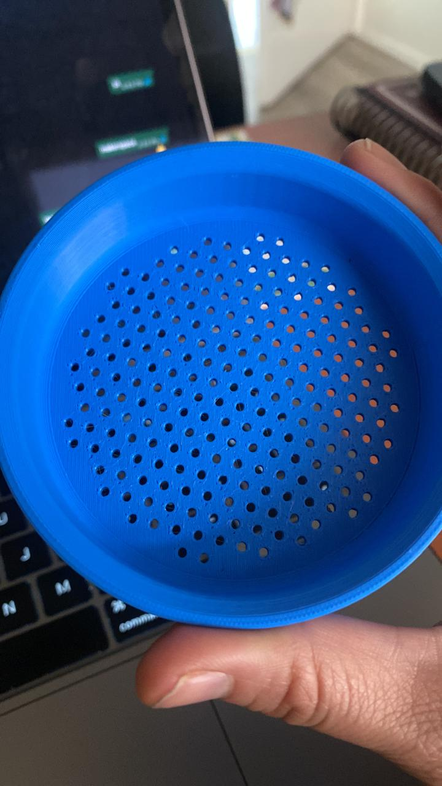

# 3D Models for soil science
Repository of 3D models and files used in soil science research and teaching

I am starting to use the MakerSpace Bibliotecas UC San Joaquín for improving my teaching and research with 3D models.

3D printers available: Prusa Mini+ and Prusa i3mk3

Using PLA for a more environmental friendly use

# Teaching

## Soil sieve 2 mm 

[thingiverse link stl](https://www.thingiverse.com/thing:7276910)

